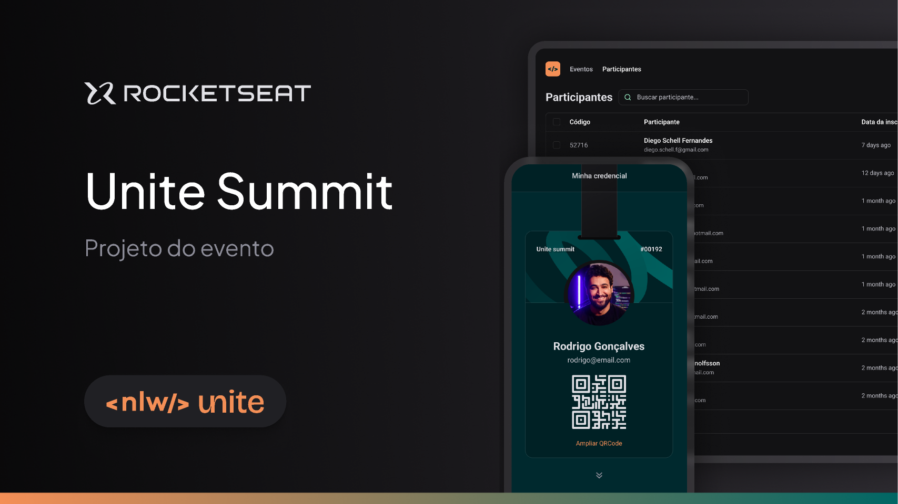

<h1 align="center"> NLW Unite </h1>

<p align="center">
  <a href="#-tecnologias">Tecnologias</a>&nbsp;&nbsp;&nbsp;|&nbsp;&nbsp;&nbsp;
  <a href="#-projeto">Projeto</a>&nbsp;&nbsp;&nbsp;|&nbsp;&nbsp;&nbsp;
  <a href="#-layout">Layout</a>&nbsp;&nbsp;&nbsp;|&nbsp;&nbsp;&nbsp;
  <a href="#-para-rodar">Para rodar</a>&nbsp;&nbsp;&nbsp;|&nbsp;&nbsp;&nbsp;
  <a href="#memo-licença">Licença</a>
</p>

<p align="center">
  
</p>

</br>



## 🚀 Tecnologias

Esse projeto foi desenvolvido com as seguintes tecnologias:

- ReactJS, Typescript, NodeJS
- Git e Github
- Figma

## 💻 Projeto

No evento NLW Unite, nosso desafio foi criar um site com uma lista de participantes de um evento.

## 🔖 Layout

Você pode visualizar o layout do projeto através [DESSE LINK](https://www.figma.com/community/file/1356738933008624188). É necessário ter conta no [Figma](https://figma.com) para acessá-lo.

## 🔧 Para rodar

É necessário fazer o clone do repositório back-end do projeto [DESSE LINK](https://github.com/rocketseat-education/nlw-unite-nodejs).

1. Ao abrir o repositório, instale todas as dependências:
    ```node
        npm i
    ```
2. Crie um arquivo de variável de ambiente **.env** com os seguintes parâmetros:
    ```
        DATABASE_URL="file:./dev.db"
    ```
3. Rodar o comando seed para preencher o banco de dados com dados fictícios:
    ```node
        npx prisma db seed
    ```
4. Por fim, basta iniciar o servidor:
    ```node
        npm run dev
    ```
Ao iniciar o back-end, é só acessar o [LINK DO SITE:](https://pass-in-web-eight.vercel.app/)


## :memo: Licença

Esse projeto está sob a licença MIT.

---

Feito com ♥ by Rocketseat :wave: [Participe da nossa comunidade!](https://discord.gg/rocketseat)